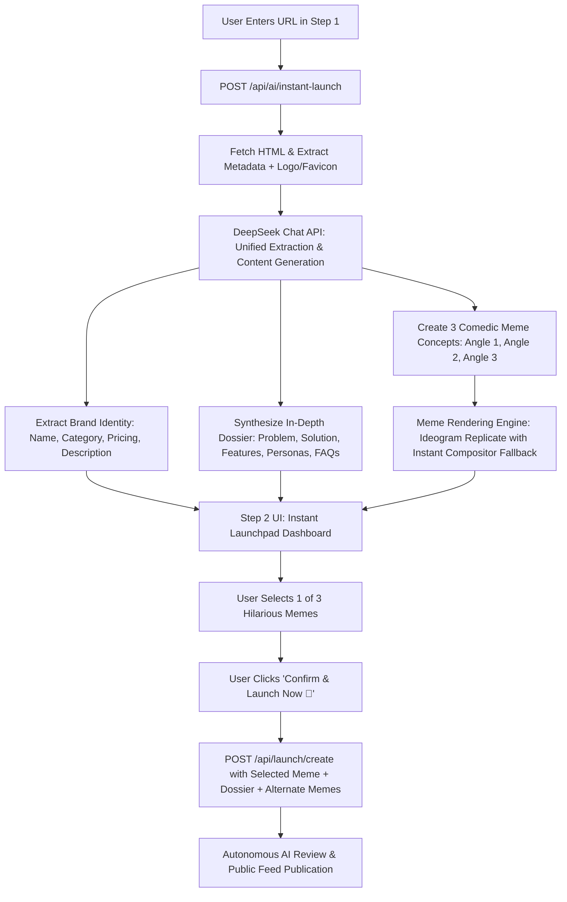

# Instant LaunchMeme Revamp Design Specification

**Date:** 2026-09-27  
**Status:** Approved  
**Topic:** Zero-Friction URL Launch with DeepSeek API & 3-Meme Selection

---

## 1. Executive Summary

The current `/launch` workflow in MemeLaunch requires significant manual input (product name, category, pricing, description, mandatory 2–3 screenshots, manual logo upload, and navigating a separate multi-step meme studio). 

This revamp replaces that friction with a **zero-effort, 2-step AI-powered launch experience**:
1. The user enters **only their website URL** (or arrives via a URL parameter from the homepage).
2. DeepSeek AI extracts all branding, analyzes the product, synthesizes **in-depth launch content** (problem statement, solution, 3–4 features, target personas, 4 FAQs), and generates **3 hilarious viral memes** across 3 contrasting comedic angles.
3. The user picks their favorite meme with one click and hits **"Confirm & Launch Now 🚀"**. Zero manual typing is required.

---

## 2. Architecture & Data Flow

---

## 3. Backend Implementation: `/api/ai/instant-launch`

### 3.1 Scraping & Asset Extraction
- Cleans and normalizes URL (prepends `https://` if protocol omitted).
- Fetches target HTML with a 10s timeout, custom User-Agent, and SSL tolerance.
- Extracts:
  - Page title (cleaned of common suffixes like `| Home`, `- Official Site`).
  - Meta description & OpenGraph description.
  - OpenGraph image (`og:image`).
  - Favicon / Apple-touch-icon URL.
  - Strips HTML tags, styles, and scripts to build a clean 4,000-character content sample for LLM context.
- Fallback for logo: Google favicon service (`https://www.google.com/s2/favicons?domain=...&sz=128`).

### 3.2 DeepSeek Chat API Integration
- System Prompt instructs DeepSeek as the "World's Greatest Tech Product Director & Viral Meme Genius".
- Requests a single strict JSON object containing:
  - `productName`: Clean, capitalized brand name.
  - `category`: Exactly one of the 12 recognized categories (`SaaS`, `Developer Tools`, `AI & Machine Learning`, etc.).
  - `pricing`: `"free" | "freemium" | "paid"`.
  - `productDescription`: Concise, high-converting 150–300 character summary.
  - `seoDossier`:
    - `tagline`: Snappy 1-liner hook.
    - `problemStatement`: The relatable, acute pain points without this product.
    - `solution`: How the product solves this headache seamlessly.
    - `features`: Array of 3–4 features with `title`, `description`, and `icon` name.
    - `targetAudience`: Array of 3 target personas and their respective benefits.
    - `faqs`: Array of 4 realistic, high-value Q&As addressing setup, pricing, and objections.
  - `memeConcepts`: Exactly 3 concepts:
    - Angle 1 ("The Relatable Struggle"): Chaos/pain of doing it manually.
    - Angle 2 ("The 10x Superpower"): The god-mode feeling of using the tool.
    - Angle 3 ("The Savage Comparison"): Mocking bloated legacy alternatives.
    - Each with punchy ALL-CAPS `topText`, `bottomText`, `caption`, and visual prompt.

### 3.3 Meme Rendering Engine
- Attempts high-resolution rendering with Ideogram via Replicate.
- If Replicate encounters latency (>8s) or is not configured, automatically generates high-contrast Impact typography overlays on curated viral templates (`meme-compositor.ts`).
- Ensures all 3 memes return within the 5–8 second budget with zero failure.

---

## 4. Frontend Revamp: `/launch` Page

### 4.1 Step 1: Clean Hero Input & Progress State
- Centered, modern UI with clear value proposition.
- Single URL input with autofocus and quick submit on Enter.
- Active multi-step progress bar during generation:
  1. *Scanning website & brand assets...*
  2. *Synthesizing in-depth dossier with DeepSeek...*
  3. *Generating 3 hilarious viral memes...*

### 4.2 Step 2: Simplified Launchpad Dashboard
- **Top Section — Choose Your Meme (1-Click Select):**
  - Displays the 3 generated memes in a 3-column responsive grid.
  - Each meme card includes:
    - Comedic Angle Badge (e.g. `🔥 The Struggle`, `⚡ 10x Superpower`, `🎯 The Savage Comparison`).
    - Meme poster visual with crisp typography.
    - Caption text.
    - Radio check indicator and neon lime border for the active selection.
    - Meme #1 selected by default.
- **Bottom Left — Sticky Live Feed Preview Card:**
  - Real-time preview of how the launch appears in the feed (logo, meme cover, pricing badge, upvote mockups).
- **Bottom Right — In-Depth Content & Launch Trigger:**
  - Tabbed / Accordion preview of the generated dossier:
    - *Overview*: Name, category, pricing, description (editable via click, but zero input required).
    - *In-Depth Dossier*: Problem, solution, key features, target personas, FAQs.
  - **Single Primary Action Button:** `[ Confirm & Launch Now 🚀 ]`.
  - Removes mandatory 2–3 screenshot requirement.
  - Preserves state across auth modals if user is not yet logged in.

---

## 5. Persistence & Publication

- On submit:
  - Hero meme URL saved to `launches.meme_image_url`.
  - In-depth content saved to `launches.seo_dossier`.
  - Alternate memes saved to `launches.seo_dossier.alternateMemes`.
  - Autonomous AI review approves the product immediately (`is_approved: true`).
  - Redirects to `/products/[productName]` or homepage with instant celebration toast.

---

## 6. Verification Plan

1. **API Integration Test:** Call `/api/ai/instant-launch` with real URLs (e.g. `https://linear.app`, `https://cursor.com`) and verify schema compliance.
2. **UI Interactive Flow Test:** Verify seamless transition from Step 1 to Step 2, one-click meme selection, in-depth content rendering, and submission.
3. **Build & Typecheck:** Run `npx tsc --noEmit` and Next.js build verification to guarantee zero errors.
